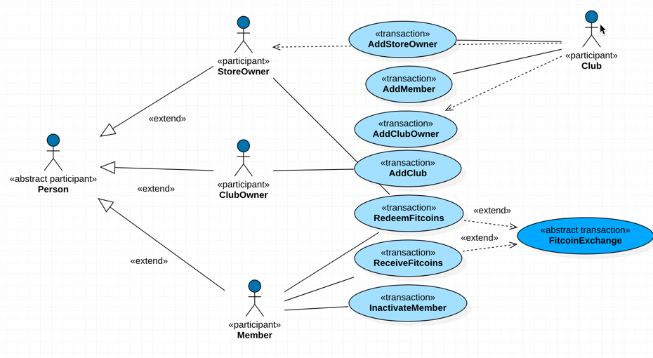

# Using Blockchain to Track Fitness Rewards

**Customized by Thomas Suedbroecker**

**Developer Pattern**
[Developer Patter: Fitness Club Rewards points iot and retail integration](https://developer.ibm.com/patterns/fitness-club-rewards-points-iot-and-retail-integration/)

If you want to play you should just use: [playground](https://www.ibm.com/developerworks/cloud/library/cl-model-test-your-blockchain-network-with-hyperledger-composer-playground/index.html)

**Table of content**
* [0 Introduction/UseCase](#part00)
* [1 Flow](#part01)
* [2 Technical Pre-requisites to run the sample locally](#part02)
* [2.1 Installing/setup pre-requisites](#part021)
* [2.1.1 Ubuntu](#part0211)
* [2.1.2 MacOS](#part0212)
* [2.1.2.1 Install nvm and Apple Xcode](#part02121)
* [2.1.3 Install Node (Ubuntu and Mac)](#part0213)
* [2.1.4 Install Docker (Ubuntu and Mac)](#part0214)
* [3 The Blockchain sample is based on three major components](#part03)
* [3.1 Featured Technologies in the Blockchain project](#part031)
* [4 Steps](#part04)
* [5 Links](#part05)
* [6 Learn more](#part06)
* [7 License](#part07)

# Introduction/UseCase <a name="part00"></a>

This is a sample **web application** that uses a Hyperledger Fabric **blockchain to track and trace fitness rewards**.

_Background/UseCase_

One of the **biggest challenges Fitness Clubs face** is maintaining members. It is always cheaper to keep a member than attract new members. To retain members, some clubs will offer loyalty programs, but oftentimes, those are ineffective because they may provide future free months or potentially offer a discount to friends and family. Sometimes, the program only rewards members when they refer friends to the club.

In order to make loyalty more effective, there are a few things that will improve the programs:

1. **Rewards for working** out incentivizes members to use the facilities
2. **Ability to use their rewards more frequently** and for more valuable purchases
3. **Visibility into their rewards lends trust** to the program

With **Fitcoins**, we even add a new feature to loyalty programs, community building. By bringing local merchants into the program, we can facilitate commerce with those merchants that want to be affiliated with the club loyalty program. This provides an easy way for members to transact with the stores using digital currency. The store owners benefit by getting access to customers they may not have had. As the store owners earn Fitcoins through purchases, those Fitcoins could potentially be exchanged for cash from the club or used to maybe purchase advertising at the club. This creates a whole ecosystem around the club and a sense of community.

_Functionality of the Fitcoin app_

With the **Fitcoin app**, a Fitness Club can **add new members**. 

For active members you can:
* **simulate** those members **receiving rewards points**
*  **redeeming rewards points**
*  **viewing their rewards** points history. 

Clubs can also **deactivate members** to simulate members cancelling their memberships, something we hope never happens.

Here is a Use Case model to do an approach on a **simplified visualization** of the  of the fitcoin system. 

* **transaction** is represented as an UML use case
* **participant** is represented as an UML actor
* **UML association** do represent the dependency inside an transaction to a participant.



---

**Architecture**

The following image shows the architecture of the **Fitcoin system**, based on Blockchain.

The **fitcoin webappliction**, **Hyperledger Composer REST Server** and **Wolfpack Fitclub Fitcoin Hyperledger Fabric Network**.


## 1 Flow  <a name="part01"></a>
---
[-> BACK to Introduction/UseCase](#part00)

You will install on your local machine and run a sample web application.

1. **Install Hyperledger Fabric** and **Composer**
2. Build and Deploy the **Fitcoin Blockchain** Network
3. Build and run the **Fitcoin Angular Web App**

## 2 Technical Pre-requisites to run the sample locally  <a name="part02"></a>
---
[-> BACK to Introduction/UseCase](#part00)

1. At least **4Gb of memory**
2. Operating Systems: Ubuntu Linux 14.04 / 16.04 LTS (both 64-bit), or Mac OS 10.12
3. **Docker Engine:** Version 17.03 or higher
4. **Docker-Compose:** Version 1.8 or higher**
5. **Node:** 8.9 or higher (note version 9 is not supported)
6. **npm:** v5.x
7. **git:** 2.9.x or higher
8. **Python:** 2.7.x

### 2.1 Installing/setup pre-requisites  <a name="part021"></a>
---
[-> BACK to Introduction/UseCase](#part00)

The following steps do contain the steps to install the given **technical pre-requisites** to run the sample locally on your PC.

#### 2.1.1 Ubuntu  <a name="part0211"></a>
---
[-> BACK to Introduction/UseCase](#part00)

1. Login as a normal user, rather than root.
2. Do not su to root.
3. When installing prerequisites, use curl, then unzip using sudo.
4. Run prereqs-ubuntu.sh as a normal user. It may prompt for root password as some of it's actions are required to be run as root.
5. Do not use npm with sudo or su to root to use it.
6. Avoid installing node globally as root.

If you're running on Ubuntu, you can download the prerequisites using the following commands:

```
curl -O https://hyperledger.github.io/composer/latest/prereqs-ubuntu.sh

chmod u+x prereqs-ubuntu.sh
```

Next run the script - as this briefly uses sudo during its execution, you will be prompted for your password.

```
./prereqs-ubuntu.sh
```

#### 2.1.2 MacOS  <a name="part0212"></a>
---
[-> BACK to Introduction/UseCase](#part00)

**Note: Mac OS X version 10.12.6 was used for these instructions.**

##### 2.1.2.1 Install nvm and Apple Xcode  <a name="part02121"></a>
---
[-> BACK to Introduction/UseCase](#part00)

First install nvm (the **Node version manager**). nvm is a tool that allows you to easily install, update and switch between versions of Node.js.

Open the terminal (command line) by clicking on the magnifier in the menu bar at the top right of your screen. Type terminal and press enter.

In the terminal window paste the text below and press enter:

```
curl -o- https://raw.githubusercontent.com/creationix/nvm/v0.33.0/install.sh | bash
```

More information on this script and the Node install process is available here.

When you hit enter you should see the pop-up below, prompting you to install git. Press the Get Xcode button to install the **full Apple Xcode IDE**, including a C++ compiler, used to install native Node.js modules.

The download and install process for Xcode may take 20 minutes or more. Be patient!

After the installation of Xcode has completed launch Xcode. Accept the license agreement. It will prompt you for your username and password and will install additional components.

After Xcode finishes installing additional components and launches, simply quit Xcode.

Switch back to the terminal and create your bash profile (stores user preferences for bash):

```
touch .bash_profile
```

Then retrun the original curl command:

```
curl -o- https://raw.githubusercontent.com/creationix/nvm/v0.33.0/install.sh | bash
```

Close the terminal and reopen it.

Check that nvm is installed and is accessible:

```
nvm —-version
```

#### 2.1.3 Install Node (Ubuntu and Mac)  <a name="part0213"></a>
---
[-> BACK to Introduction/UseCase](#part00)

Install the latest (long term support) version of Node:
```
nvm install --lts
```
Switch to the LTS version of Node:
```
nvm use --lts
```
Check that Node is installed:
```
node --version
```

#### 2.1.4 Install Docker (Ubuntu and Mac)  <a name="part0214"></a>
---
[-> BACK to Introduction/UseCase](#part00)

Follow the instructions here to install Docker for Mac (stable): https://docs.docker.com/docker-for-mac/install/

After running the installed Docker application you should have the whale icon in your menu bar, with a green “Docker is running” status.


## 3 The Blockchain sample is based on three major components  <a name="part03"></a>
---
[-> BACK to Introduction/UseCase](#part00)

You have to follow later the different readmes in this github project.

1. [Hyperledger Fabric and Hyperledger Composer](https://github.com/thomassuedbroecker/Using-Blockchain-to-Track-fitness-Rewards/tree/master/fabric-dev-servers)

This sub-project obtains the **Hyperledger Composer development tools** (primarily used to create Business Networks) and stand up a Hyperledger Fabric (primarily used to run/deploy your Business Networks **locally**). 

_Note:_  The **Business Networks** you create can also be deployed to **Hyperledger Fabric runtimes** in other environments e.g. on a cloud platform.

2. [Fitcoin Blockchain Network Archive](https://github.com/thomassuedbroecker/Using-Blockchain-to-Track-fitness-Rewards/tree/master/wolfpack-fitclub-fitcoin)

This sub-project includes the **definition** of the **Hyperledger Fabric** and **Composer blockchain network**. Hyperledger models consist of a few components.

3. [Fitcoin Angular Web App](https://github.com/thomassuedbroecker/Using-Blockchain-to-Track-fitness-Rewards/tree/master/fitcoin-app)

In that sub-project  you can find the sample webapplication.

The users will interact with the blockchain through a **web UI** written using **Node.js** and **Angular 2 (6.x)** framework.

### 3.1 Featured Technologies in the Blockchain project  <a name="part031"></a>
---
[-> BACK to Introduction/UseCase](#part00)

The following technologies are used to implement the sample application.

1. [Angular](https://angular.io/)
2. [Node.js](https://nodejs.org/en/)
3. [Docker](https://www.docker.com/)
4. [NVM](https://github.com/creationix/nvm/blob/master/README.md)
5. [Apple Xcode](https://developer.apple.com/xcode/)


## 4 Steps  <a name="part04"></a>
---
[-> BACK to Introduction/UseCase](#part00)

These are the steps to setup the Blockchain sample.
You have to follow the readme to each step.

1. [Install Hyperledger Fabric and Composer](./fabric-dev-servers/README.md)
2. [Build and deploy the Fitcoin Blockchain Network](./wolfpack-fitclub-fitcoin/README.md)
3. [Build and run the Fitcoin Angular Web App](./fitcoin-app/README.md)

## 5 Links  <a name="part05"></a>
---
[-> BACK to Introduction/UseCase](#part00)

* [IBM Blockchain - Marbles demo](https://github.com/IBM-Blockchain/marbles)
* [Hyperledger Composer](https://hyperledger.github.io/composer/latest/index.html)


## 6 Learn more  <a name="part06"></a>
---
[-> BACK to Introduction/UseCase](#part00)

* **Blockchain Code Patterns**: Enjoyed this Code Pattern? Check out our other [Blockchain Code Patterns](https://developer.ibm.com/code/technologies/blockchain/)

* **Blockchain 101**: Learn why IBM believes that blockchain can transform businesses, industries – and even the world. [Blockchain 101](https://developer.ibm.com/code/technologies/blockchain/)

## 7 License  <a name="part07"></a>
---
[-> BACK to Introduction/UseCase](#part00)

[Apache 2.0](LICENSE)
